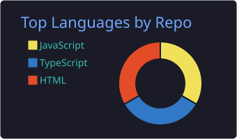

# Hi there, I'm Chamodya Devindi 👋

🎓 IT Undergraduate | 💻 Aspiring Full-Stack Developer

I'm passionate about building modern web applications and exploring new technologies. I enjoy turning ideas into practical software solutions and continuously improving my development skills.

  

## 🎓 About Me

- 🎓 IT Undergraduate
- 💻 Interested in Full-Stack Development
- ☕ Working with Java and Spring
- 🌐 Building web applications using modern technologies
- 🌱 Continuously learning and improving my development skills

## 💻 Most Used Languages

  

## 💻 Languages

## 🛠 Technologies

### 💻 Top Languages

  

## 📫 Contact 
-Email:chamodyadevindi2004@gmail.com
-Linkedin:www.linkedin.com/in/chamodya-devindi
